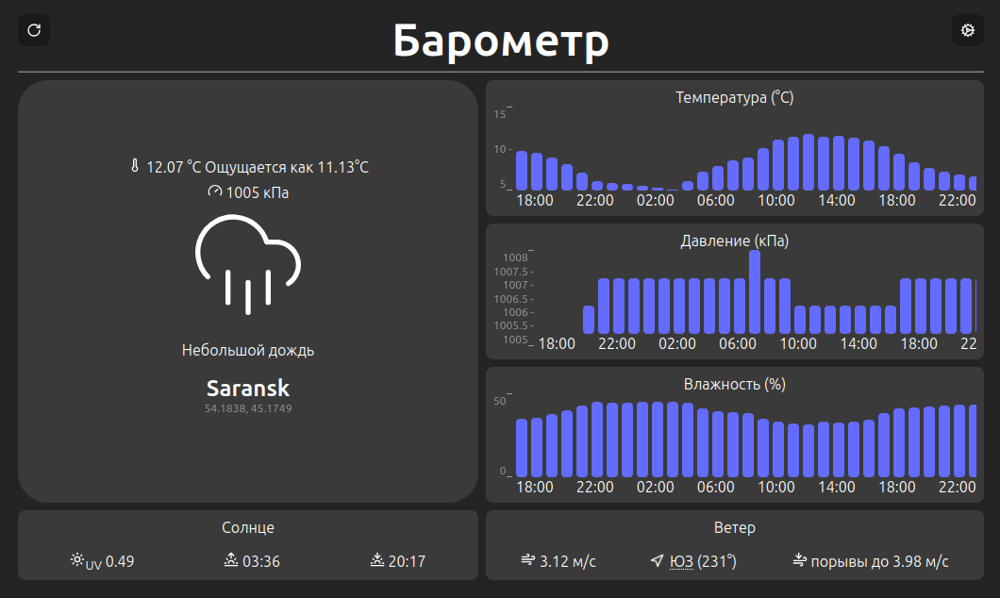

# Барометр (Barometer)

Простое приложение на Vue 3 для мониторинга погоды с визуализацией данных в виде графиков.



## Возможности

- **Текущая погода** — температура, ощущаемая температура, давление, влажность, описание состояния
- **Почасовой прогноз** — графики температуры, давления и влажности на 24 часа
- **Солнце** — UV-индекс, время восхода и заката
- **Ветер** — скорость, направление (с розой ветров), порывы
- **Источники данных** — поддержка [Open-Meteo](https://open-meteo.com) (без API-ключа) и [OpenWeatherMap](https://openweathermap.org)
- **Настройки** — выбор локации, период обновления, система единиц
- **Офлайн-режим** — тестовые данные через `fake-data` API-ключ
- **Тёмная тема** — встроенный тёмный интерфейс

## Технологии

| Стек                  | Инструменты          |
| --------------------- | -------------------- |
| **Фреймворк**         | Vue 3.5 + TypeScript |
| **Сборка**            | Vite 7               |
| **Стилизация**        | SCSS                 |
| **Иконки**            | Lucide Vue           |
| **Пакетный менеджер** | Yarn 4               |
| **Линтинг**           | ESLint + Prettier    |

## Установка и запуск

```bash
# Установка зависимостей
yarn
# или
yarn install

# Запуск в режиме разработки
yarn dev

# Сборка для production
yarn build

# Предпросмотр production-сборки
yarn preview
```

## Настройка

Вы можете выбрать любой из источников данных который вас больше устраивает.

### Open-Meteo (по умолчанию)

Не требует API-ключа. Просто укажите координаты в настройках.

### OpenWeatherMap

1. Получите API-ключ на [openweathermap.org](https://openweathermap.org/api)
2. В настройках приложения выберите источник `Open Weather Map` и вставьте ключ

### Тестовые данные

Для работы без API введите `fake-data` вместо API-ключа. Тестовые данные есть только для OpenWeatherMap поэтому обязательно выбрать именно этот источник.

## Архитектура

### Источники данных

Приложение создано так, чтобы поддерживать данные из разных источников. Для этого источники должны реализовывать следующий интерфейс:

```typescript
interface IDataSource {
  units: AppUnit;
  error: string | null;
  readonly name: string;
  readonly url: string;
  readonly location: GeoLocation;
  readonly loading: boolean;
  readonly loaded: boolean;
  readonly current: CurrentConditions;
  readonly daily: DailyConditions[];
  readonly hourly: HourlyConditions[];
  refresh(): void;
}
```
